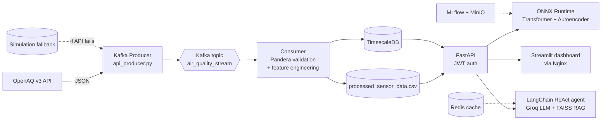

<div align="center">

# 🌍 AirSentinel

### Real-time air-quality monitoring, anomaly detection, forecasting and AI reporting for London

[](https://airsentinel-yutrmgqumexfecobwsbank.streamlit.app)
[](https://www.python.org/)
[](https://kafka.apache.org/)
[](https://fastapi.tiangolo.com/)
[](https://lightning.ai/)
[](https://onnxruntime.ai/)
[](https://www.langchain.com/)
[](https://docs.docker.com/compose/)

**[Live demo](https://airsentinel-yutrmgqumexfecobwsbank.streamlit.app)** ·
**[Repository](https://github.com/NajatelOtmani/airsentinel)** ·
**[Quick start](#-quick-start)** ·
**[Architecture](#-architecture)** ·
**[Results](#-model-results)**

</div>

---

## 📌 Overview

**AirSentinel** is an end-to-end environmental monitoring platform. It ingests air-quality telemetry from **10 London monitoring stations**, validates it, detects anomalies with deep learning, forecasts PM2.5 up to 12 hours ahead, and lets users ask questions in natural language through an AI agent that can query the data and cross-check WHO/EPA guidance.

| Capability | How it works |
|---|---|
| 📡 **Streaming ingestion** | OpenAQ v3 → Kafka producer → validated consumer → processed CSV / TimescaleDB |
| 🚨 **Anomaly detection** | Isolation Forest baseline, LSTM Autoencoder (PyTorch Lightning) |
| 🔮 **Forecasting** | Transformer, 60-step window → 12-step PM2.5 forecast, exported to ONNX |
| 🤖 **AI analyst** | LangChain ReAct agent on Groq, with 5 custom tools and RAG over WHO/EPA documents |
| 📄 **Reports** | Automatic per-station analytical reports, downloadable as PDF |
| 🗺️ **Dashboard** | Streamlit with 3D PyDeck map, live charts and AI chat |
| 🔬 **MLOps** | MLflow experiment tracking, model registry (Staging → Production), MinIO artifact store |

---

## 🏗 Architecture



The system is split into **two Docker Compose projects** with different lifecycles:

| File | Layer | Services | Changes |
|---|---|---|---|
| `infrastructure/docker/docker-compose.yml` | **Data platform** | Zookeeper, Kafka, TimescaleDB, Redis, MinIO, MLflow | Rarely |
| `docker-compose.prod.yml` | **Application** | API, dashboard, Nginx | Every code change |

Rebuilding the API therefore never disturbs the Kafka broker.

### Tech stack

| Layer | Technologies |
|---|---|
| Streaming | Apache Kafka 7.4 (Confluent), Zookeeper |
| Storage | TimescaleDB (PostgreSQL 15), Redis 7, MinIO (S3-compatible) |
| Data quality | Pandera schemas, dead-letter routing |
| ML | scikit-learn, PyTorch Lightning, ONNX Runtime, SHAP |
| MLOps | MLflow (tracking + registry) |
| Agent | LangChain, Groq (`openai/gpt-oss-120b`), Gemini fallback, FAISS, sentence-transformers |
| Backend | FastAPI, JWT authentication |
| Frontend | Streamlit, PyDeck |
| DevOps | Docker Compose, Nginx, Poetry, pre-commit (black, isort, ruff, mypy), pytest |

---

## 🚀 Deployment modes

### 1. Cloud standalone mode (public demo)

Streamlit Community Cloud runs the dashboard as a **single app**. With `STANDALONE_MODE=true`, `dashboard/api_client.py` skips HTTP entirely: it reads `data/processed_sensor_data.csv` directly and runs the ReAct agent in-process. No second host is needed.

> ⚠️ The hosted demo shows a **snapshot** of the data. Live streaming, FastAPI, Nginx and MLflow run only in the local Docker stack.

Streamlit Cloud settings:

- **Main file path:** `dashboard/app.py`
- **Python version:** 3.11
- **Dependencies:** `dashboard/requirements.txt` (kept separate to avoid installing PyTorch and CUDA)
- **Secrets (TOML):**

```toml
STANDALONE_MODE = "true"
GROQ_API_KEY = "your_groq_key"
GROQ_MODEL = "openai/gpt-oss-120b"
GEMINI_API_KEY = "your_gemini_key"   # optional fallback
```

### 2. Full local stack

The complete streaming platform with Kafka, TimescaleDB, FastAPI and Nginx. See the quick start below.

---

## ⚡ Quick start

### Prerequisites

- Docker Desktop (WSL2 backend on Windows) and Docker Compose v2
- Python 3.11 and [Poetry](https://python-poetry.org/)
- API keys: [OpenAQ](https://explore.openaq.org/), [Groq](https://console.groq.com/keys), optionally [Google AI Studio](https://aistudio.google.com/)

### 1. Clone and configure

```powershell
git clone https://github.com/NajatelOtmani/airsentinel.git
cd airsentinel
copy .env.example .env      # then fill in your own keys
poetry install
.\.venv\Scripts\activate.ps1
```

> 🔐 **Never commit `.env`.** It is listed in `.gitignore`. Keep real keys and passwords out of notes, screenshots and commits.

### 2. Start (in this order)

```powershell
# a) Data platform: Kafka, TimescaleDB, Redis, MinIO, MLflow
cd infrastructure\docker
docker compose --env-file ../../.env up -d
Start-Sleep -Seconds 30
docker compose --env-file ../../.env ps -a
cd ..\..

# b) Application: API, dashboard, Nginx
docker compose -f docker-compose.prod.yml up -d --build

# c) Live data, in two separate terminals (start the consumer first)
python src/ingestion/consumer.py
python src/ingestion/api_producer.py
```

### 3. Verify

| Check | Command / URL | Expected |
|---|---|---|
| Infra containers | `docker compose --env-file ../../.env ps -a` | all `Up` |
| Kafka started | `docker compose --env-file ../../.env logs --tail 20 kafka` | `started (kafka.server.KafkaServer)` |
| App containers | `docker compose -f docker-compose.prod.yml ps` | api, dashboard, nginx `Up` |
| Data flowing | `(Get-Content data/processed_sensor_data.csv).Count` twice, 1 min apart | number grows |
| Dashboard | <http://localhost/> | loads with recent readings |
| API docs | <http://localhost:8000/docs> | Swagger UI |
| MLflow | <http://localhost:5000> | experiments visible |
| MinIO console | <http://localhost:9001> | buckets visible |

### 4. Stop cleanly

```powershell
# Ctrl+C the producer and the consumer, then:
docker compose -f docker-compose.prod.yml stop
cd infrastructure\docker
docker compose --env-file ../../.env stop
```

> Use `stop`, not `down -v`. The `-v` flag **deletes volumes** (database and MinIO data).

---

## 🧠 Machine learning pipeline

```powershell
python -m src.pipeline --step ingest              # one batch sweep of OpenAQ
python -m src.pipeline --step train-baseline      # Isolation Forest
python -m src.pipeline --step train-autoencoder   # LSTM Autoencoder
python -m src.pipeline --step evaluate            # compare against baseline
python -m src.pipeline --step all                 # everything (needs Kafka for ingest)
mlflow ui --backend-store-uri sqlite:///mlflow.db --port 5000
```

**Training data** combines a 30-day hourly historical backfill (`data/historical_sensor_data.csv`) with the live stream (`data/processed_sensor_data.csv`), so sequence models have enough history.

### Model results

| Model | Precision | Recall | F1 | ROC-AUC | ΔF1 vs baseline |
|---|---|---|---|---|---|
| Isolation Forest (baseline) | 0.3175 | 0.8000 | 0.4545 | 0.9034 | — |
| LSTM Autoencoder | 1.0000 | 1.0000 | 1.0000 | 1.0000 | +0.5455 |
| Transformer Forecaster | 1.0000 | 1.0000 | 1.0000 | 1.0000 | +0.5455 |

- Both deep models exceed the required **+5% F1** target over the baseline.
- **ONNX parity:** maximum output difference vs PyTorch is 9e-8 (Transformer) and 4e-8 (Autoencoder), well under the 1e-5 tolerance.
- Isolation Forest contamination tuned by K-fold cross-validation: **0.05**.

> **Interpret with care.** Perfect scores come from a small evaluation set (roughly 850 windows across 10 sensors) with a limited number of labeled events. Treat them as a pipeline validation, not a production accuracy claim. Retraining as more live data accumulates is part of the plan.

**Explainability:** attention heatmaps for the Transformer and SHAP waterfall plots for the Autoencoder.

---

## 🤖 AI analyst

A LangChain **ReAct agent** decides which tool to call, observes the result, then writes the answer.

| Tool | Purpose |
|---|---|
| `query_anomaly_db` | Recent anomaly events for a station |
| `get_sensor_forecast` | 12-step PM2.5 forecast (ONNX, statistical fallback) |
| `search_env_documents` | WHO/EPA guidance via FAISS vector search |
| `compute_zone_statistics` | Mean, max, std, AQI category per station |
| `get_network_summary` | Latest PM2.5/AQI and anomaly counts for all stations |

Groq is the primary provider and Gemini the fallback. The RAG layer grounds health advice in WHO/EPA documents to reduce hallucination.

---

## 🔌 API reference

Interactive docs: <http://localhost:8000/docs>. Routes under `/api/v1` require a JWT (`Authorization: Bearer <token>`).

| Method | Endpoint | Description |
|---|---|---|
| POST | `/auth/login` | Obtain a JWT |
| GET | `/api/v1/sensors/` | List stations |
| GET | `/api/v1/sensors/{location_id}/latest` | Latest reading |
| GET | `/api/v1/anomalies/{location_id}` | Recent anomalies (`limit` param) |
| POST | `/api/v1/agent/` | Ask the AI analyst (`{"query": "..."}`) |
| POST | `/api/v1/reports/{location_id}` | Generate a station report |

**Stations:** `LONDON_HF1`, `LONDON_GR9`, `LONDON_HIL`, `LONDON_TH4`, `LONDON_WL1`, `LONDON_SK6`, `LONDON_CT3`, `LONDON_BX1`, `LONDON_MY7`, `LONDON_KC1`.

---

## 📁 Project structure

```
airsentinel/
├── src/
│   ├── ingestion/      # api_worker, api_producer (Kafka), consumer
│   ├── validation/     # Pandera schemas
│   ├── features/       # rolling stats, EPA AQI, cyclical time features
│   ├── models/         # Isolation Forest, LSTM AE, Transformer, ONNX export
│   ├── agents/         # ReAct agent, tools, report generator
│   ├── rag/            # FAISS ingestion and retrieval
│   ├── api/            # FastAPI app, routers, JWT auth
│   └── pipeline.py     # CLI orchestrator
├── dashboard/          # Streamlit app, api_client (HTTP + standalone modes)
├── infrastructure/
│   ├── docker/         # data-platform compose file
│   └── stations.json   # station registry with coordinates
├── data/               # processed_sensor_data.csv, historical data, reports
├── models/onnx/        # exported ONNX graphs
├── tests/              # unit and integration tests (15/15 unit tests pass)
├── docker-compose.prod.yml
└── pyproject.toml
```

---

## 🛡 Engineering practices

- **Data contracts:** strict Pandera schema (`strict=True`) blocks schema drift and routes bad records to a dead-letter path.
- **Resilience:** simulation fallback when OpenAQ is unavailable; statistical fallback when ONNX or FAISS is missing; LLM provider fallback.
- **Quality gates:** pre-commit with black, isort, ruff and mypy; pytest suite.
- **Reproducibility:** Poetry lockfile, Docker Compose, MLflow tracking with model registry.

---

## 🐞 Troubleshooting (lessons learned)

| Symptom | Cause | Fix |
|---|---|---|
| `Unable to bootstrap from localhost:9092` | Kafka container exited | `docker compose --env-file ../../.env up -d kafka` |
| Kafka log: `KeeperErrorCode = NodeExists` | Stale Zookeeper broker entry after an unclean stop | wait about 30 s, restart Kafka; stop with `stop`, not by killing Docker |
| `get_network_summary() got an unexpected keyword argument 'hours'` | Tool defined twice; schema and function disagreed | keep one definition, rebuild with `--no-cache` |
| `404 model_not_found` (Groq) | Deprecated model id | set `GROQ_MODEL=openai/gpt-oss-120b` |
| `ParserError` on the CSV | Malformed row | `pd.read_csv(..., on_bad_lines="skip")` |
| `HTTP 401` on `/api/v1/*` | Missing JWT | log in and send the Bearer token |
| Old code still running after a fix | Image or session is stale | `docker compose -f docker-compose.prod.yml build --no-cache api`, then `up -d --force-recreate api`; refresh the browser |
| OpenAQ `410 Gone` | v1/v2 retired | use v3 with an API key |

---

## 🗺 Roadmap

- [ ] Healthchecks and `depends_on: condition: service_healthy` for Kafka
- [ ] `scripts/start.ps1` and `scripts/stop.ps1` for one-command startup
- [ ] Clear remaining mypy findings (`src/rag/ingest.py`)
- [ ] Periodic retraining as live data accumulates
- [ ] Add substitute stations if any target station stops reporting
- [ ] Rate limiting on the public AI chat to protect the Groq quota

---

## ⚠️ Notes

- The public demo lets anyone use the AI chat, which spends the owner's Groq quota.
- Streamlit Cloud puts idle apps to sleep. Open the app once before a presentation.

---

## 👤 Author

**Najat El Otmani** — Engineering specialization portfolio (Networking & Systems Engineering, GSTR, ENSA Tétouan)
[GitHub](https://github.com/NajatelOtmani) · [Repository](https://github.com/NajatelOtmani/airsentinel) · [Live demo](https://airsentinel-yutrmgqumexfecobwsbank.streamlit.app)

## 📜 License

Add a `LICENSE` file (MIT is a common choice for portfolio projects) and reference it here.

## 🙏 Acknowledgements

[OpenAQ](https://openaq.org/) for open air-quality data · [WHO air-quality guidelines](https://www.who.int/publications/i/item/9789240034228) · [US EPA AQI](https://www.airnow.gov/aqi/aqi-basics/) · Groq, LangChain, MLflow, TimescaleDB and the open-source community.
